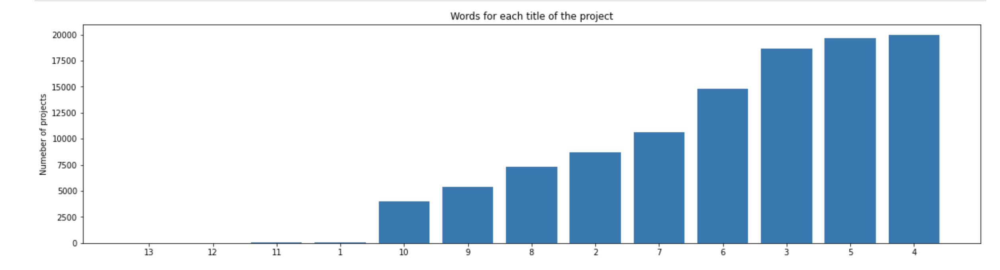

# Donor-s-Choose-Project-Approval

## Business Problem

DonorsChoose.org receives hundreds of thousands of project proposals each year for classroom projects in need of funding. Right now, a large number of volunteers is needed to manually screen each submission before it's approved to be posted on the DonorsChoose.org website.

    Next year, DonorsChoose.org expects to receive close to 500,000 project proposals. As a result, there are three main problems they need to solve:
<ul>
<li>
    How to scale current manual processes and resources to screen 500,000 projects so that they can be posted as quickly and as efficiently as possible</li>
    <li>How to increase the consistency of project vetting across different volunteers to improve the experience for teachers</li>
    <li>How to focus volunteer time on the applications that need the most assistance</li>
    </ul>

    

The goal of the competition is to predict whether or not a DonorsChoose.org project proposal submitted by a teacher will be approved, using the text of project descriptions as well as additional metadata about the project, teacher, and school. DonorsChoose.org can then use this information to identify projects most likely to need further review before approval.

# Dataset Information

The `train.csv` data set provided by DonorsChoose contains the following features:

Feature | Description 
----------|---------------
**`project_id`** | A unique identifier for the proposed project. **Example:** `p036502`   
**`project_title`**    | Title of the project. **Examples:** <ul><li><code>Art Will Make You Happy!</code></li><li><code>First Grade Fun</code></li></ul> 
**`project_grade_category`** | Grade level of students for which the project is targeted. One of the following enumerated values:  <ul><li><code>Grades PreK-2</code></li><li><code>Grades 3-5</code></li><li><code>Grades 6-8</code></li><li><code>Grades 9-12</code></li></ul>  
 **`project_subject_categories`** | One or more (comma-separated) subject categories for the project from the following enumerated list of values:   <ul><li><code>Applied Learning</code></li><li><code>Care &amp; Hunger</code></li><li><code>Health &amp; Sports</code></li><li><code>History &amp; Civics</code></li><li><code>Literacy &amp; Language</code></li><li><code>Math &amp; Science</code></li><li><code>Music &amp; The Arts</code></li><li><code>Special Needs</code></li><li><code>Warmth</code></li></ul>  **Examples:**  <ul><li><code>Music &amp; The Arts</code></li><li><code>Literacy &amp; Language, Math &amp; Science</code></li>  
  **`school_state`** | State where school is located ([Two-letter U.S. postal code](https://en.wikipedia.org/wiki/List_of_U.S._state_abbreviations#Postal_codes)). **Example:** `WY`
**`project_subject_subcategories`** | One or more (comma-separated) subject subcategories for the project. **Examples:**  <ul><li><code>Literacy</code></li><li><code>Literature &amp; Writing, Social Sciences</code></li></ul> 
**`project_resource_summary`** | An explanation of the resources needed for the project. **Example:**  <ul><li><code>My students need hands on literacy materials to manage sensory needs!</code</li></ul> 
**`project_essay_1`**    | First application essay*  
**`project_essay_2`**    | Second application essay* 
**`project_essay_3`**    | Third application essay* 
**`project_essay_4`**    | Fourth application essay* 
**`project_submitted_datetime`** | Datetime when project application was submitted. **Example:** `2016-04-28 12:43:56.245`   
**`teacher_id`** | A unique identifier for the teacher of the proposed project. **Example:** `bdf8baa8fedef6bfeec7ae4ff1c15c56`  
**`teacher_prefix`** | Teacher's title. One of the following enumerated values:  <ul><li><code>nan</code></li><li><code>Dr.</code></li><li><code>Mr.</code></li><li><code>Mrs.</code></li><li><code>Ms.</code></li><li><code>Teacher.</code></li></ul>  
**`teacher_number_of_previously_posted_projects`** | Number of project applications previously submitted by the same teacher. **Example:** `2` 

* See the section <b>Notes on the Essay Data</b> for more details about these features.

Additionally, the `resources.csv` data set provides more data about the resources required for each project. Each line in this file represents a resource required by a project:

Feature | Description 
----------|---------------
**`id`** | A `project_id` value from the `train.csv` file.  **Example:** `p036502`   
**`description`** | Desciption of the resource. **Example:** `Tenor Saxophone Reeds, Box of 25`   
**`quantity`** | Quantity of the resource required. **Example:** `3`   
**`price`** | Price of the resource required. **Example:** `9.95`   

**Note:** Many projects require multiple resources. The `id` value corresponds to a `project_id` in train.csv, so you use it as a key to retrieve all resources needed for a project:

The data set contains the following label (the value you will attempt to predict):

Label | Description
----------|---------------
`project_is_approved` | A binary flag indicating whether DonorsChoose approved the project. A value of `0` indicates the project was not approved, and a value of `1` indicates the project was approved.

### Explanatory Data Analysis - EDA and plots

 

 

### Feature Engineering

### List of categorical feature
* school state
* teacher_prefix
* project_grade_category
* clean_categories
* clean_subcategories

We use one hot encoding vectors to represent all the categorical features

### List of Numerical feature
* price
* teacher_number_of_previously_posted_projects

As we are training Decision Tree Model, we haven't used any transformation on 
numerical data as Decision Tree is not affected by variance of numerical features

### Text Features
* Title
* essay

For Title and Essay we used two different factorizing method

1. TfIdf vectorized
   - we only consider words which appear in **at least 10 essays** to reduce the size of dimensions.
   - After fitting on train_data dimension of dataset were : **16623 dimensions** for each essay
2. TfIdf weighted W2V 
   - used **pretrained Glove (300 dimension)** vectors train on very large corpus size.
   
# Result 

| Vectorizer               | Model                        | Best Hyper parameters                   | AUC    |
|--------------------------|------------------------------|-----------------------------------------|--------|
|  BOW                     | Naive Bayes                  | Alpha : 0.1  | 0.6299 |
|  TFIDF                   | Naive Bayes          | Alpha : 0.0001    | 0.5220|
|  TFIDF                   | Decision Tree                | max_depth : 10, Min_sample_split = 500  | 0.6486 |
|  TFIDF_weighted W2V      | Decision Tree                | max_depth : 10, Min_sample_split = 500  | 0.6374 |
|  TFIDF                   | DT with Nonzero feature importance          | max_depth : 10, Min_sample_split = 500    | 0.6496|
|  TFIDF                   | GBDT                | max_depth : 3, n_estimators = 100  | 0.7263 |
|  TFIDF_weighted W2V      | GBDT               | max_depth : 3,  n_estimators = 100   | 0.7137|
|   W2V, Custom Trainable Embedding layer for Categorical features                   | Model 1 LSTM    | lr : 0.001, Adam, Batch size= 256, epoch = 20 | 0.7243|
|  Removed Low and High IDF words,W2V, Custom Trainable Embedding layer for Categorical features                   | Model 2 LSTM    | lr : 0.001, Adam, Batch size= 256, epoch = 20 | 0.7385|
| W2V, One Hot Encoding For Categorical features                   | Model 3 LSTM    | lr : 0.001, Adam, Batch size= 512, epoch = 20 | 0.7584|

### Modeling

# 1. Decision Tree
   * Trained **Decision Tree Model** by combining all the **numerical, categorical and text** features into combined dataset.
   * used GridSearchCv for hyperparameter tuning for **max_depth, and min_sample_split** parameter.
   * after training Decision Tree, I trained another decision Tree but we only used all the features having nonzero feature importance.
   * after training, I analyse the results of all the **false positive test data points** using **word cloud, price distribution**

 

# Performance of Best Model Decision Tree

### Roc auc curve best Decision Tree model

### Confusion Matrix of Best  Decision Tree Model

# False Positive Test Data Point Analysis : Decision Tree

### Word cloud 

### BoxPlot price False positive test data point

### BoxPlot project count for Teacher previously posted :   False positive test data point

# 2. GBDT 

   * Trained **Gradient Boosted  Decision Tree Model** by combining all the **numerical, categorical and text** features into combined dataset.
   * used GridSearchCv for hyperparameter tuning for **max_depth, and number of tree estimator** parameter.
   
## 2.1 Heatmaps for a parameter GridSearch Cross Validation
## 2.1.1 Heatmaps for TFIDF Text Features

## 2.1.2 Heatmaps for TFIDF weighted W2V Text Features

## 2.2 ROC AUC curve
## 2.2.1 ROC AUC for TFIDF Text Features

## 2.2.2 ROC AUC for TFIDF weighted W2V Text Features

## 2.3 Confusion Matrix
## 2.3.1 Confusion Matrix for TFIDF Text Features

## 2.3.2 Confusion Matrix for TFIDF weighted W2V Text Features

# 3. LSTM 

   * I trained 3 different lstm based model, for **all the models**, I used **Glove vector based embedding layers**, essay embedding layer is non-trainable.
   * For Model 1, I transformed every **categorical columns to custom embedding layer.**
   * For **Model 2**, I **removed low idf and high idf** value words from train data and used same architecture as model 1.
   * For **Model 3** I encoded every **categorical column** using **one hot** encoded layer, and used Conv1D and combination of LSTM cells.

## 3.1 Model Architecture

## 3.1.1

## 3.1.2 Model 2 feature information
   1. I used TF-IDF vectorizer on the Train data 

   2. Get the idf value for each word we have in the train data.

   3. I did some analysis on the Idf values and based on those values I choose the low and high threshold value. Because very 
frequent words and very very rare words don't give much information.
   4.Removed the low idf value and high idf value words from the train and test data. I go through each of the
sentence of train and test data and include only those features(words) which are present in the defined IDF range.
   5. Perform tokenization on the modified text data same as you have done for previous model.
   6. Create embedding matrix for model 2 and then use the rest of the features similar to previous model.
   7. Define the model, compile and fit the model. (used same architecture as model1)

## 3.1.3 Model 3 architecture

## 3.2 Loss Plot and Accuracy plot

## 3.2.1 Model1 Loss and Accuracy

## 3.2.2 Model2 Loss and Accuracy

## 3.2.3 Model3 Loss and Accuracy

# Result 

| Vectorizer               | Model                        | Best Hyper parameters                   | AUC    |
|--------------------------|------------------------------|-----------------------------------------|--------|
|  BOW                     | Naive Bayes                  | Alpha : 0.1  | 0.6299 |
|  TFIDF                   | Naive Bayes          | Alpha : 0.0001    | 0.5220|
|  TFIDF                   | Decision Tree                | max_depth : 10, Min_sample_split = 500  | 0.6486 |
|  TFIDF_weighted W2V      | Decision Tree                | max_depth : 10, Min_sample_split = 500  | 0.6374 |
|  TFIDF                   | DT with Nonzero feature importance          | max_depth : 10, Min_sample_split = 500    | 0.6496|
|  TFIDF                   | GBDT                | max_depth : 3, n_estimators = 100  | 0.7263 |
|  TFIDF_weighted W2V      | GBDT               | max_depth : 3,  n_estimators = 100   | 0.7137|
|   W2V, Custom Trainable Embedding layer for Categorical features                   | Model 1 LSTM    | lr : 0.001, Adam, Batch size= 256, epoch = 20 | 0.7243|
|  Removed Low and High IDF words,W2V, Custom Trainable Embedding layer for Categorical features                   | Model 2 LSTM    | lr : 0.001, Adam, Batch size= 256, epoch = 20 | 0.7385|
| W2V, One Hot Encoding For Categorical features                   | Model 3 LSTM    | lr : 0.001, Adam, Batch size= 512, epoch = 20 | 0.7584|

 
   

